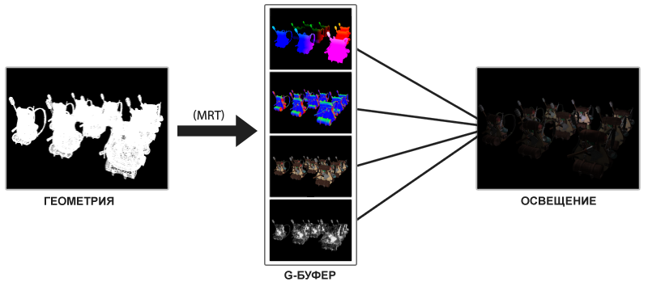

# Архитектура

`Отложенное затенение` (или `deferred rendering`) способ редлеринга с множеством источников свеиа.

Отложенное затенение основано на идее, разделить процесс рендера на несколько частей. Метод состоит из двух этапов: в первом проходе, называемом геометрическим, визуализируется сцена один раз и извлекается вся геометрическая информация (векторы положения, векторы цвета, векторы нормалей и/или значения зеркальной составляющей), которую сохраняем в коллекции текстур, называемой G-буфером. Затем, геометрическая информация сцены, хранящаяся в G-буфере, будет использоваться для (более сложных) расчетов освещения.

Далее, для текстур из G-буфера наступает вторая фаза вычислений, называемая проходом освещения, в котором мы визуализируем прямоугольную область - "монитор" (так как нам больше ничего не надо, ведь это не будет видно), и вычисляем освещение сцены для каждого фрагмента, используя геометрическую информацию, хранящуюся в G-буфере; пиксель за пикселем мы перебираем G-буфер. Вместо того, чтобы проходить с каждым объектом весь путь от вершинного шейдера до фрагментного шейдера, мы отодвигаем вычисления над его фрагментами на более позднюю стадию. Расчеты освещения остаются точно такими же, но на этот раз мы берем все необходимые входные переменные из соответствующих текстур G-буфера (и некоторых uniform-переменных), а не из вершинного шейдера.




Основное преимущество данного этапа заключается в том, что любой фрагмент, который попадает в G-буфер, по факту, является информацией об отображаемом на экране пикселе. Тест глубины уже определил, что рассматриваемый фрагмент является последним и самым верхним фрагментом. Это гарантирует, что для каждого пикселя, который мы обрабатываем в проходе освещения, освещение вычисляется только один раз.

Однако рассматриваемый способ имеет и некоторые недостатки, поскольку G-буфер требует от нас хранения относительно большого количества данных сцены в его цветовых буферах. Из-за этого идет повышенный расход памяти, т.к. информация о сцене (например, векторы позиции) требуют вычислений более высокой степени точности.

## G-буфер

G-буфер — это собирательный термин для всех текстур, хранящих в себе информацию, так или иначе связанную с освещением, задействованных на этапе прохода освещения. Давайте воспользуемся этим моментом, чтобы кратко рассмотреть все данные, необходимые нам для освещения фрагмента при использовании метода прямого рендеринга:

- 3D-вектор позиции (в координатах мирового пространства) для вычисления (интерполированной) переменной позиции фрагмента (в дальнейшем используемой переменными lightDir и viewDir);

- вектор диффузного цвета (RGB), также известный как альбедо;

- 3D-вектор нормали для определения наклона поверхности;

- переменная типа float интенсивности зеркальной составляющей;

- все векторы позиции источника света и его цвета;

- вектор позиции игрока или наблюдателя.

```c++
	// 1. Геометрический проход: рендеринг всех геометрических/цветовых данных в G-буфер 
    glBindFramebuffer(GL_FRAMEBUFFER, gBuffer);
    glClearColor(0.0, 0.0, 0.0, 1.0); // оставляем его черным, чтобы не было просачивания в G-буфер
    glClear(GL_COLOR_BUFFER_BIT | GL_DEPTH_BUFFER_BIT);
    gBufferShader.use();
    for(Object obj : Objects)
    {
        ConfigureShaderTransformsAndUniforms();
        obj.Draw();
    }  
 
    // 2. Проход освещения: используем G-буфер для вычисления освещения сцены
    glBindFramebuffer(GL_FRAMEBUFFER, 0);
    lightingPassShader.use();
    BindAllGBufferTextures();
    SetLightingUniforms();
    RenderQuad();
```

Данные по каждому фрагменту, которые мы должны сохранить, это:

- вектор позиции;

- вектор нормали;

- цветовой вектор;

- значение интенсивности отражения.

Для геометрического прохода нам нужно будет инициализировать переменную фреймбуфера с названием gBuffer, которая имеет несколько подключенных цветовых буферов и один объект рендербуфера глубины. Для хранения позиций и нормалей объекта мы будем использовать переменную текстуры повышенной точности (каждый компонент будет иметь 16- или 32-битное значение типа float). Для альбедо и значений зеркальной составляющей хватит и стандартной точности (каждый компонент — 8-битное значение). Обратите внимание, что мы используем GL_RGBA16F вместо GL_RGB16F, поскольку графические процессоры обычно предпочитают 4-компонентные форматы графических данных 3-компонентным форматам из-за выравнивания байтов; в противном случае некоторые драйверы могут не завершить построение фреймбуфера.

```c++
unsigned int gBuffer;
glGenFramebuffers(1, &gBuffer);
glBindFramebuffer(GL_FRAMEBUFFER, gBuffer);
unsigned int gPosition, gNormal, gColorSpec;
  
// Цветовой буфер позиций
glGenTextures(1, &gPosition);
glBindTexture(GL_TEXTURE_2D, gPosition);
glTexImage2D(GL_TEXTURE_2D, 0, GL_RGBA16F, SCR_WIDTH, SCR_HEIGHT, 0, GL_RGBA, GL_FLOAT, NULL);
glTexParameteri(GL_TEXTURE_2D, GL_TEXTURE_MIN_FILTER, GL_NEAREST);
glTexParameteri(GL_TEXTURE_2D, GL_TEXTURE_MAG_FILTER, GL_NEAREST);
glFramebufferTexture2D(GL_FRAMEBUFFER, GL_COLOR_ATTACHMENT0, GL_TEXTURE_2D, gPosition, 0);
  
// Цветовой буфер нормалей
glGenTextures(1, &gNormal);
glBindTexture(GL_TEXTURE_2D, gNormal);
glTexImage2D(GL_TEXTURE_2D, 0, GL_RGBA16F, SCR_WIDTH, SCR_HEIGHT, 0, GL_RGBA, GL_FLOAT, NULL);
glTexParameteri(GL_TEXTURE_2D, GL_TEXTURE_MIN_FILTER, GL_NEAREST);
glTexParameteri(GL_TEXTURE_2D, GL_TEXTURE_MAG_FILTER, GL_NEAREST);
glFramebufferTexture2D(GL_FRAMEBUFFER, GL_COLOR_ATTACHMENT1, GL_TEXTURE_2D, gNormal, 0);
  
// Цветовой буфер цвета + отраженной составляющей
glGenTextures(1, &gAlbedoSpec);
glBindTexture(GL_TEXTURE_2D, gAlbedoSpec);
glTexImage2D(GL_TEXTURE_2D, 0, GL_RGBA, SCR_WIDTH, SCR_HEIGHT, 0, GL_RGBA, GL_UNSIGNED_BYTE, NULL);
glTexParameteri(GL_TEXTURE_2D, GL_TEXTURE_MIN_FILTER, GL_NEAREST);
glTexParameteri(GL_TEXTURE_2D, GL_TEXTURE_MAG_FILTER, GL_NEAREST);
glFramebufferTexture2D(GL_FRAMEBUFFER, GL_COLOR_ATTACHMENT2, GL_TEXTURE_2D, gAlbedoSpec, 0);
  
// Сообщаем OpenGL, какой прикрепленный цветовой буфер (задействованного фреймбуфера) собираемся использовать для рендеринга
unsigned int attachments[3] = { GL_COLOR_ATTACHMENT0, GL_COLOR_ATTACHMENT1, GL_COLOR_ATTACHMENT2 };
glDrawBuffers(3, attachments);

// Создаем и прикрепляем буфер глубины (рендербуфер)
unsigned int rboDepth;
glGenRenderbuffers(1, &rboDepth);
glBindRenderbuffer(GL_RENDERBUFFER, rboDepth);
glRenderbufferStorage(GL_RENDERBUFFER, GL_DEPTH_COMPONENT, SCR_WIDTH, SCR_HEIGHT);
glFramebufferRenderbuffer(GL_FRAMEBUFFER, GL_DEPTH_ATTACHMENT, GL_RENDERBUFFER, rboDepth);

// Проверяем готовность фреймбуфера
if (glCheckFramebufferStatus(GL_FRAMEBUFFER) != GL_FRAMEBUFFER_COMPLETE)
        std::cout << "Framebuffer not complete!" << std::endl;
glBindFramebuffer(GL_FRAMEBUFFER, 0);
```

Далее нам нужно выполнить рендеринг в G-буфер. Предполагая, что каждый объект имеет диффузную, нормальную и зеркальную текстуры, для рендеринга в G-буфер мы бы использовали что-то вроде следующего фрагментного шейдера:

```c++
//frag
#version 330 core
layout (location = 0) out vec3 gPosition;
layout (location = 1) out vec3 gNormal;
layout (location = 2) out vec4 gAlbedoSpec;
 
in vec2 TexCoords;
in vec3 FragPos;
in vec3 Normal;
 
uniform sampler2D texture_diffuse1;
uniform sampler2D texture_specular1;
 
void main()
{    
    // Храним вектор позиции фрагмента в первой текстуре G-буфера
    gPosition = FragPos;
 
    // Также храним нормали каждого фрагмента в G-буфере
    gNormal = normalize(Normal);
 
    // И диффузную составляющую цвета каждого фрагмента
    gAlbedoSpec.rgb = texture(texture_diffuse1, TexCoords).rgb;
 
    // Сохраняем значение интенсивности зеркальной составляющей в альфа-компоненте переменной gAlbedoSpec
    gAlbedoSpec.a = texture(texture_specular1, TexCoords).r;
}
```

## Этап прохода освещения

Имея в своем распоряжении большой набор фрагментных данных в G-буфере, мы можем полностью рассчитать конечные цвета освещения сцены. Мы сделаем это, перебирая пиксель за пикселем каждую из текстур G-буфера и используя их содержимое в качестве входных данных для алгоритмов освещения. Поскольку все значения текстуры G-буфера представляют собой конечные преобразованные значения фрагментов, то нам приходится выполнять дорогостоящие операции освещения только один раз для каждого пикселя. Это особенно полезно в сложных сценах, где мы, при использовании метода прямого рендеринга, должны были бы задействовать несколько дорогостоящих вызовов фрагментных шейдеров (для каждого пикселя).

Для этапа прохода освещения мы собираемся визуализировать экранный 2D-прямоугольник и для каждого пикселя будем производить дорогостоящий вызов фрагментного шейдера освещения:


```c++
glClear(GL_COLOR_BUFFER_BIT | GL_DEPTH_BUFFER_BIT);
glActiveTexture(GL_TEXTURE0);
glBindTexture(GL_TEXTURE_2D, gPosition);
glActiveTexture(GL_TEXTURE1);
glBindTexture(GL_TEXTURE_2D, gNormal);
glActiveTexture(GL_TEXTURE2);
glBindTexture(GL_TEXTURE_2D, gAlbedoSpec);
 
// Посылаем соответствующие uniform-переменные освещения
shaderLightingPass.use();
SendAllLightUniformsToShader(shaderLightingPass);
shaderLightingPass.setVec3("viewPos", camera.Position);
RenderQuad();
```

```c++
//frag
#version 330 core
out vec4 FragColor;
  
in vec2 TexCoords;
 
uniform sampler2D gPosition;
uniform sampler2D gNormal;
uniform sampler2D gAlbedoSpec;
 
struct Light {
    vec3 Position;
    vec3 Color;
};
const int NR_LIGHTS = 32;
uniform Light lights[NR_LIGHTS];
uniform vec3 viewPos;
 
void main()
{             
    // Получаем данные из G-буфера
    vec3 FragPos = texture(gPosition, TexCoords).rgb;
    vec3 Normal = texture(gNormal, TexCoords).rgb;
    vec3 Albedo = texture(gAlbedoSpec, TexCoords).rgb;
    float Specular = texture(gAlbedoSpec, TexCoords).a;
    
    // Затем вычисляем освещение как обычно
    vec3 lighting = Albedo * 0.1; // фоновая составляющая
    vec3 viewDir = normalize(viewPos - FragPos);
    for(int i = 0; i < NR_LIGHTS; ++i)
    {
        // Диффузная составляющая
        vec3 lightDir = normalize(lights[i].Position - FragPos);
        vec3 diffuse = max(dot(Normal, lightDir), 0.0) * Albedo * lights[i].Color;
        lighting += diffuse;
    }
    
    FragColor = vec4(lighting, 1.0);
} 
```