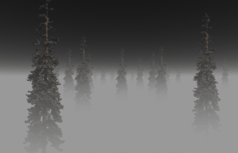

# Туман

`Эффект тумана`  достигается при имитации рассеивания света в тумане.Отдаленные от камеры объекты теряют контраст и становятся с туманом одного цвета при достаточном расстоянии.



На малопроизводительных системах данный метод позволет скрывать плохо прогруженные локации, текстуры , снизить нагрузку на ГП.
## Эффект тумана с применением шейдеров

Можно моделировать объемный туман, который ограничен одной плоскостью, но в остальном имеет бесконечную протяженность, используя шейдеры.
Для расчета всех параметров можно применять формулы
Объем тумана, ограниченный одной плоскостью, но в остальном бесконечно протяженный, имеет множество применений.
в приложениях для интерактивного рендеринга. Например, ограничивающей плоскостью может являться
максимальная высота, которую достигает туман на открытом воздухе, он может совпадать
с водным покровом, чтобы ограничить распространение тумана на водные поверхности, или он может служить
граница между различными средами. В таких случаях частичное расстояние в объеме тумана, через которое свет проходит между точкой поверхности и
камера должна быть определены для каждого отображаемого пикселя. Но это сложные расчеты, для которых существуют унифицированные формулы, которые обеспечивают правильное пройденное расстояние
через полупространство тумана для всех точек поверхности и положений камеры, что позволяет использовать
фрагментный шейдер. Одна формула выводится для объема, имеющего
постоянная плотность тумана, и вторая формула выводится для объема, имеющего плотность тумана
который линейно увеличивается с расстоянием от ограничивающей плоскости.
- линейные туман `f=p(e-d)` 

`f` доля тумана, `p` плотность, `d` расстояние тумана

```c++
//вершинный шейдер
#version 330

uniform mat4 ModelViewProjectionMatrix;

layout(location = 0) in vec4 Vertex;
layout(location = 1) in vec4 Color;

//передаем цвет и координаты кажой вершины 
out VertexData{
vec4 mColor;
vec4 mVertex;
} VertexOut;

void main(void)
{
VertexOut.mColor = Color;
VertexOut.mVertex = Vertex;
gl_Position = ModelViewProjectionMatrix * Vertex;
}
```

Цвет тумана это  смесь переданного цвета геометрии и цвета фона.
То есть за пределами минимального расстояния геометрия или ее часть будут полностью видны, а за пределами максимального расстояния геометрия больше не будет видна.

```c++
#version 330
//фрагментный шейдер
uniform vec4 CameraEye;
uniform vec4 FogColor;

in VertexData{
vec4 mColor;
vec4 mVertex;
} VertexIn;

float getFogFactor(float d)
{
const float FogMax = 20.0;
const float FogMin = 10.0;

if (d>=FogMax) return 1;
if (d<=FogMin) return 0;

return 1 - (FogMax - d) / (FogMax - FogMin);
}

void main(void)
{
vec4 V = VertexIn.mVertex;
float d = distance(CameraEye, V);
float alpha = getFogFactor(d);

gl_FragColor = mix(VertexIn.mColor, FogColor, alpha);
}
```
